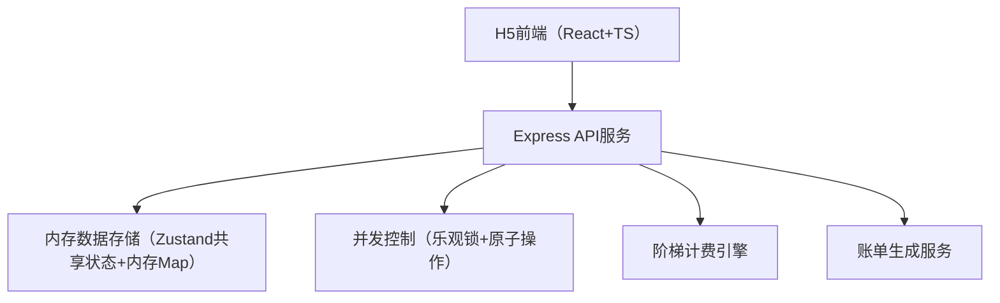
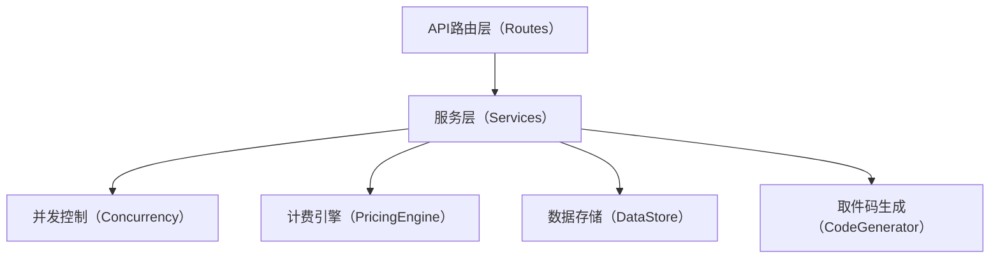
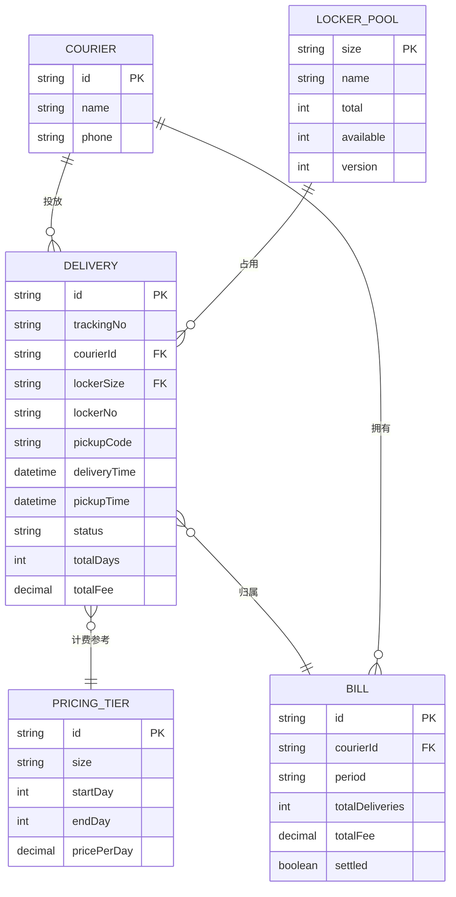

## 1. 架构设计



## 2. 技术描述
- 前端：React@18 + TypeScript + tailwindcss@3 + vite + zustand + lucide-react + react-router-dom
- 初始化工具：vite-init
- 后端：Express@4 + TypeScript
- 数据存储：内存数据结构（开发演示用，含mock数据），后续可扩展为Redis+SQLite
- 并发控制：基于版本号的乐观锁机制 + Map级别的原子操作

## 3. 路由定义

| 路由 | 用途 |
|------|------|
| / | Dashboard首页 - 格口概览与快捷操作 |
| /delivery | 投放管理 - 格口选择、投放表单、在途列表 |
| /pricing | 计费设置 - 阶梯档位维护、计费预览 |
| /bills | 账单查询 - 投放明细、费用汇总 |
| /verify | 取件核销 - 取件码输入、核销结算 |

## 4. API 定义

### 4.1 类型定义

```typescript
// 格口类型
type LockerSize = 'S' | 'M' | 'L';

interface LockerPool {
  size: LockerSize;
  name: string;
  total: number;
  available: number;
  version: number; // 乐观锁版本号
}

// 阶梯费率
interface PricingTier {
  id: string;
  size: LockerSize;
  startDay: number; // 起始天数（含）
  endDay: number;   // 结束天数（含），-1表示无限
  pricePerDay: number; // 每日单价（元）
}

// 投放记录
interface DeliveryRecord {
  id: string;
  trackingNo: string;
  courierId: string;
  courierName: string;
  lockerSize: LockerSize;
  lockerNo: string;
  pickupCode: string;
  recipientPhone: string;
  deliveryTime: number; // 投放时间戳
  pickupTime?: number;   // 取件时间戳
  status: 'in_transit' | 'picked_up' | 'cancelled';
  totalDays: number;
  tierDetails: { tierId: string; days: number; unitPrice: number; subtotal: number }[];
  totalFee: number;
}

// 账单
interface Bill {
  id: string;
  courierId: string;
  courierName: string;
  period: string;
  totalDeliveries: number;
  totalFee: number;
  settled: boolean;
  records: string[];
}
```

### 4.2 API端点

| Method | Path | 说明 |
|--------|------|------|
| GET | /api/lockers | 获取格口池实时余量 |
| POST | /api/delivery | 投放快递（带乐观锁扣减） |
| GET | /api/delivery | 获取投放记录列表 |
| POST | /api/verify | 取件码核销结算 |
| GET | /api/pricing | 获取阶梯费率配置 |
| PUT | /api/pricing | 更新阶梯费率配置 |
| POST | /api/pricing/calculate | 预览计费计算 |
| GET | /api/bills | 获取账单列表 |
| GET | /api/bills/:id | 获取账单明细 |

## 5. 服务端架构



## 6. 数据模型

### 6.1 ER图



### 6.2 并发扣减机制
- 每次获取格口信息时返回 `version` 版本号
- 投放请求必须携带预期 `version`
- 服务端原子校验：版本匹配且 `available > 0` 才执行扣减
- 扣减成功后 `version++`，失败返回 409 Conflict
- 客户端自动重试最多3次
